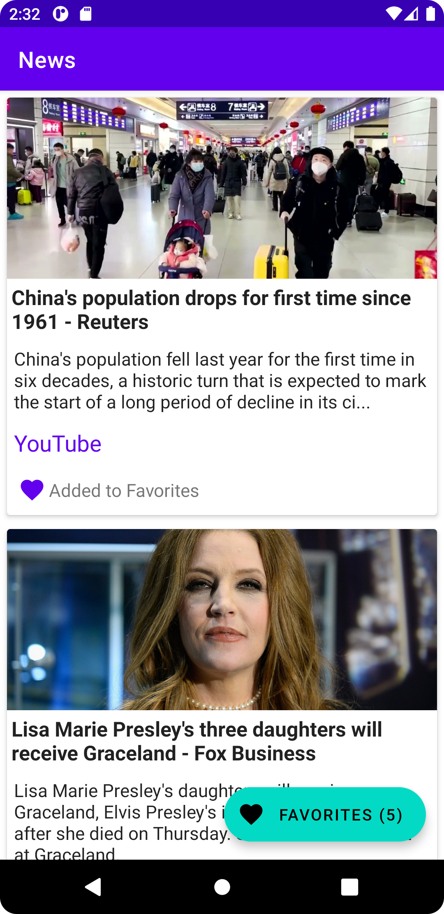
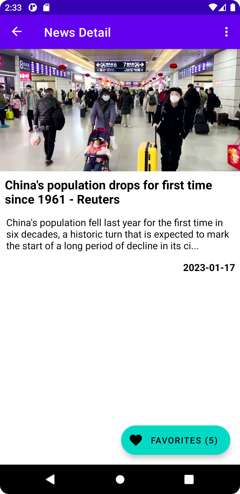

## News App!
With **News App**, you can list breaking news and read the details of the news. If you like the news, you can add it to your favorites. You can get events for favorited news with **Firebase Analytics**.

### Pages
**- News**
Lists breaking news. You can add the news to your favorites from the list and see your favorited news count **in real time**.
**- News Detail**
Shows news detail. You can also add the news to your favorites from this app.
**- Favorites**
Lists favorited news. You can go to **News Details** page from here.

### Built With
This project developed with **MVVM** pattern.

- [NewsApi](https://newsapi.org/)
 - Firebase
 - Retrofit
 - OkHttp
 - Jetpack Compose

## Getting Started

 - Android Studio - [Download](https://developer.android.com/studio)


 ### Installation
 1. Get a free api key at https://newsapi.org
In project/gradle add your api key in buildTypes section.
	```sh
		buildTypes {
		 release {
			  ...
			  buildConfigField "String", "NEWSAPIKEY","\"YOUR_API_KEY\""`
		 }
		 debug {
			  ...
		  	  buildConfigField "String", "NEWSAPIKEY","\"YOUR_API_KEY\""`
		 }
		}
	```

2. Clone the repo

    ```sh
    git clone https://github.com/your_username_/Project-Name.git
    ```

 3. Go to [Firebase Console](https://console.firebase.google.com/project/_/database) and create your project and add Android part. While creating project you should chose Firebase Analytics enabled or you can active later. Add **google-service.json** file to project as shown. Enable Realtime Database and Authentication features. In Authentication page, go to **Sign-in method** tab and activate **Anonymous** sign in.
 4.  All done. You can build and launch the app.

## Screenshots




